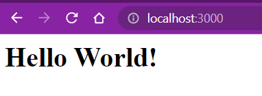

# M08 - UF03 - NodeJs
Nodejs és un entorn en temps d’execució multiplataforma per a la capa del servidor basat en
JavaScript. Es controla per events i està disenyat per a crear aplicacions escalables amb múltiples
connexios a la vegada.

El seu gran avantatge és que no hi ha bloqueig de procesos en l’execució de les aplicacións perquè
aquestes no treballen amb processos sinó que ho fan en blocs. Enlloc de treballar amb llibreries,
Nodejs presenta un bucle d’events invisible per a l’usuari en el temps d’execució. A més a més, té
molta velocitat en l’execució de codi, les seves dades no s’enmagatzemen al búffer, és asíncron i es
controla per events.

Principalment l’utilitzen els desenvolupadors per a configurar aplicacions de transmissió de dades
en temps real, aplicacions basades en la API de JSON, aplicaicons vinculades a l’entrada i sortida
de dades i aplicacions d’una sola pàgina web. Linkedi, Ebay, Netflix, PayPal o la NASA són
algunes de les empreses que utilitzen aquesta tecnologia. Es pot combinar amb moltes altres
tecnologies i llenguatges per a obtenir aplicacons molt potents.

## Instal·lació
Obrir terminal
```
root@DESKTOP-G4Q9KRE:~# apt update
root@DESKTOP-G4Q9KRE:~# apt install nodejs
```
Comprovar la versió:
```
root@DESKTOP-G4Q9KRE:~# nodejs -v
v12.22.9
```
### Node Packet Manager
El npm es l'administrador de paquets de Nodejs, Aquest paquet permet instal·lar altres moduls per utilitzar-los amb Nodejs
```
root@DESKTOP-G4Q9KRE:~# apt install npm
```
Comprovem la versió
```
root@DESKTOP-G4Q9KRE:~# npm -v
8.5.1
```
## Configuració
Un cop disposem de l’entorn instal·lat, podem inicialitzar npm:
```
root@DESKTOP-G4Q9KRE:/home/teoria# npm init
This utility will walk you through creating a package.json file.
It only covers the most common items, and tries to guess sensible defaults.

See `npm help init` for definitive documentation on these fields
and exactly what they do.

Use `npm install <pkg>` afterwards to install a package and
save it as a dependency in the package.json file.

Press ^C at any time to quit.
```
El package es crearà al mateix directori on ens trobem, aixi que abans de fer el _npm init_ situeu-vos al directori on voleu treballar.

Aqui li estem donant nom al package, sino agafarà el nom per defecte del directori on ens trobem. 

Es important comprovar el camp del _"entry point"_, ja que defineix el nom del fitxer on hem de treballar. Aquest fitxer no es crea automaticament, l'hem de crear nosaltres i donar-li el mateix nom
```
package name: (teoria)
version: (1.0.0)
description:
entry point: (index.js)
test command:
git repository:
keywords:
author: Aida Carbonell Niubó
license: (ISC)
About to write to /home/teoria/package.json:

{
  "name": "teoria",
  "version": "1.0.0",
  "description": "",
  "main": "index.js",
  "scripts": {
    "test": "echo \"Error: no test specified\" && exit 1"
  },
  "author": "Aida Carbonell Niubó",
  "license": "ISC"
}


Is this OK? (yes)
```

Llistem el directori per veure el que node ha creat
```
root@DESKTOP-G4Q9KRE:/home/teoria# ls
package.json
```

Podem obrir tot el directori al VScode i gestionar els arxius amb l'interficie grafica de la IDE de VScode.
L'arxiu _index.js_ l'hem de crear nosaltres, ha de tenir el mateix nom qu eli hem indicat en el _package.json_
```
root@DESKTOP-G4Q9KRE:/home/teoria# code .
```
O utilitzar un editor de la mateixa terminal per fer el codi:
```
root@DESKTOP-G4Q9KRE:/home/teoria# nano index.js
```
Utilitzem el següent codi per veure com funciona
```
const http = require("http");
const hostname = "localhost";
const port = 3000;
const server = http.createServer((req, res) => {
    console.log(req.headers);
    res.statusCode = 200;
    res.end("<html><body><h1>Hello World!</h1></body></html>")
})
server.listen(port, hostname);
```

Tornem a la terminal i executem
```
root@DESKTOP-G4Q9KRE:/home/teoria# node index.js
```



I per tancar el servidor s'utilitza la comanda 
```
^C
```

## Utilitzar paquets npm
Abans d'utilitzar paquets nous es important llegir la documentació, que la pots trobar a la web:
[https://www.npmjs.com/](https://www.npmjs.com/)
Per instal·lar un paquet:
```
root@DESKTOP-G4Q9KRE:/home/teoria# npm install express

added 57 packages, and audited 58 packages in 2s

7 packages are looking for funding
  run `npm fund` for details

found 0 vulnerabilities
```
en llistar el directori veurem que s'ha afegit el paquet amb les seves dependencies
```
root@DESKTOP-G4Q9KRE:/home/teoria# ls
index.js  node_modules  package-lock.json  package.json
```
Per exemple el paquet _express_ serveix per aixecar un servidor de manera més rapida que la que hem vist abans:

```
const express = require('express')
const app = express()

app.get('/', function (req, res) {
  res.send("<html><body><h1>Hello World!</h1></body></html>")
})

app.listen(3000)
```
i molt més que es pot fer amb els diferents paquets
### [Exercici 01](exercicis/ej01.md)
